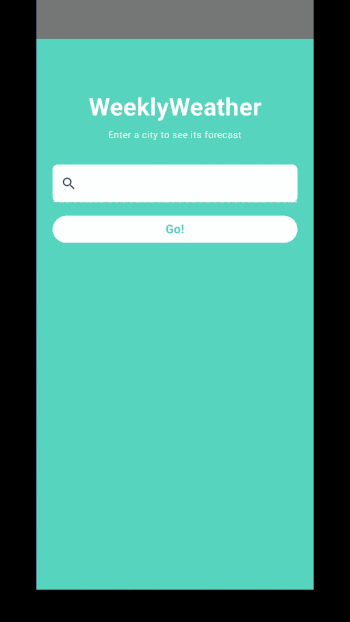

# WeeklyWeather
WeeklyWeather is inspired by [WeatherChecker](https://github.com/ersiver/WeatherChecker) by ersiver. The original app was built with traditional Android Views (XML layouts, Fragments, Data Binding, RecyclerView, LiveData). This version rebuilds the same general functionality using:

- **Jetpack Compose** for all UI
- **Material 3** theming
- **StateFlow** instead of LiveData
- **Sealed interface UI state** instead of multiple LiveData fields

## Tech stack

- Kotlin
- Jetpack Compose + Material 3
- Lifecycle ViewModel + StateFlow
- Coroutines
- Retrofit + Moshi
- Open-Meteo (no API key required)

## Building

1. Open in Android Studio (Panda or newer)
2. Let Gradle sync
3. Run on an emulator with API 24+

## Future work

The original WeatherChecker included a Widget. For keeping inline with the original goal of converting from
Android Views to Jetpack Compose it is omitted in this repo.
Reintroducing widget support would be possible in the future.

Other potential extensions:
- GPS-based current location detection from permissions
- Multiple saved cities / favorites
- Hourly forecast view with clickable cards

## Credits

- Original Views-based project: [ersiver/WeatherChecker](https://github.com/ersiver/WeatherChecker)
- Weather data: [Open-Meteo](https://open-meteo.com/) (CC BY 4.0)
- Weather icons: ported from the original WeatherChecker project, sourced from [Flaticon](https://flaticon.com) (Freepik, Swifticons, Good Ware, Vitaliy Gorbachev, Those Icon, Hirschwolf Lineal, Iconixar, Eucalyp, Pixel Perfect)
